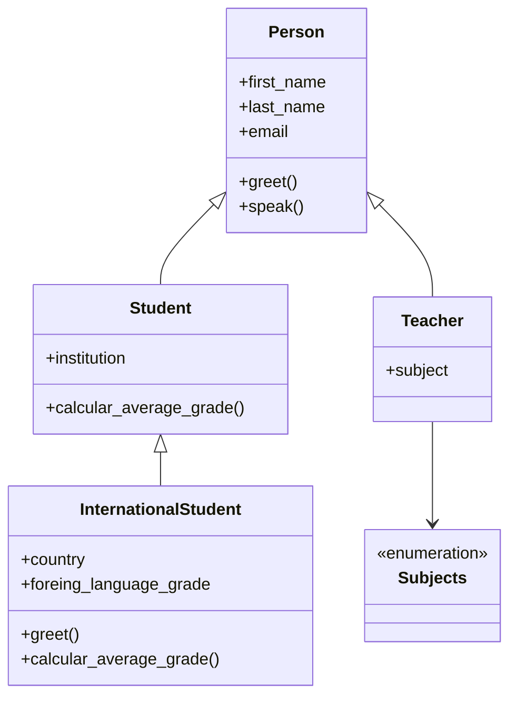
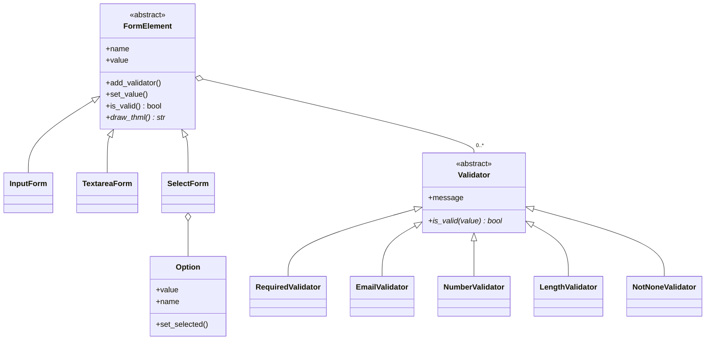
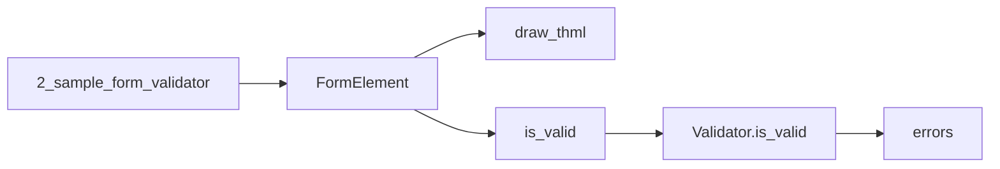

# Python Expert

Repositorio de práctica para reforzar las bases de Python. El contenido se va actualizando a medida que avanza el curso.

## Objetivo

Repasar y consolidar fundamentos de Python con ejemplos cortos y ejercicios prácticos, sin depender solo de la memoria de proyectos anteriores.

## Requisitos

- Python **3.12+**
- [uv](https://docs.astral.sh/uv/) (gestor de entorno y dependencias del proyecto)

## Cómo empezar

```bash
# Clonar el repositorio
git clone <url-del-repo>
cd "python expert"

# Crear/sincronizar el entorno virtual
uv sync

# Activar el entorno (Windows PowerShell)
.venv\Scripts\Activate.ps1

# Ejecutar el script principal
uv run main.py
```

Para correr cualquier práctica:

```bash
uv run practica_datetime.py
uv run practica_timestamp.py
uv run poo/1_car_sample.py
uv run -m inheritance.sample.sample_inheritance
uv run -m abstract_class.form.1_sample_form_element
uv run -m abstract_class.form.2_sample_form_validator
```

## Estructura del proyecto

```
python expert/
├── main.py                      # Punto de entrada básico
├── practica_datetime.py         # Fechas y horas (datetime, locale)
├── practica_timestamp.py        # Timestamps (time / datetime)
├── poo/                         # Programación orientada a objetos
│   ├── 1_car_sample.py … 8_car_sample.py   # Ejemplos progresivos
│   ├── car.py, vehicle.py       # Clases principales
│   ├── engine.py, fuel_tank.py, wheel.py, person.py
│   ├── color.py, car_type.py    # Enums
│   └── constants.py
├── inheritance/                 # Herencia y polimorfismo
│   ├── models/
│   │   ├── person.py            # Clase base
│   │   ├── student.py           # Hereda de Person
│   │   ├── teacher.py           # Hereda de Person
│   │   ├── international_student.py  # Hereda de Student
│   │   └── subjects.py          # Enum de materias
│   └── sample/
│       ├── sample_inheritance.py
│       ├── 2_sample_inheritance_constructor.py
│       └── 3_sample_inheritance_constructor.py
├── abstract_class/              # Clases abstractas (ABC) y validación de formularios
│   ├── form/
│   │   ├── form_element.py      # ABC: dibuja HTML y corre validadores
│   │   ├── input_form.py        # Hereda de FormElement
│   │   ├── textarea_form.py     # Hereda de FormElement
│   │   ├── select_form.py       # SelectForm + Option
│   │   ├── 1_sample_form_element.py
│   │   └── 2_sample_form_validator.py
│   └── validator/
│       ├── validator.py         # ABC de validación
│       ├── required_validator.py
│       ├── email_validator.py
│       ├── number_validator.py
│       ├── length_validator.py
│       └── not_none_validator.py
├── pyproject.toml
└── README.md
```

## Arquitectura

### Herencia (`inheritance/`)

`Person` es la base. `Student` y `Teacher` la especializan; `InternationalStudent` extiende `Student` y sobrescribe `greet`, `calcular_average_grade` y `__str__`.



### Formularios y validadores (`abstract_class/`)

Dos ABCs separan responsabilidades. `FormElement` define el contrato de un campo (dibujar HTML y validar). `Validator` define la regla. Cada campo **compone** una lista de validadores y los recorre en `is_valid`.



Flujo de `2_sample_form_validator.py`: se arma el campo, se le agregan validadores, se asigna el valor y `is_valid()` acumula los mensajes de error.



## Temas cubiertos

| Tema | Estado | Archivos |
|------|--------|----------|
| Fechas y horas (`datetime`) | En curso | `practica_datetime.py` |
| Timestamps | En curso | `practica_timestamp.py` |
| POO — clases, `__init__`, atributos | En curso | `poo/1_car_sample.py` … `poo/4_equal_sample.py` |
| POO — dataclasses, constantes, enums | En curso | `poo/5-car_sample_dataclass.py` … `poo/7_car_sample_enum.py` |
| POO — composición (motor, tanque, ruedas) | En curso | `poo/8_car_sample.py` + modelos en `poo/` |
| Herencia y polimorfismo | En curso | `inheritance/` (`Person`, `Student`, `Teacher`, `InternationalStudent`) |
| `isinstance`, `cast`, tipado | En curso | `inheritance/sample/` |
| Clases abstractas (`abc.ABC`) | En curso | `abstract_class/form/form_element.py`, `abstract_class/validator/validator.py` |
| Formularios HTML (herencia + composición) | En curso | `abstract_class/form/` (`InputForm`, `TextareaForm`, `SelectForm`) |
| Validadores (estrategia sobre ABC) | En curso | `abstract_class/validator/` + `2_sample_form_validator.py` |

> Esta tabla se irá ampliando con nuevos temas del curso (estructuras de datos, funciones, excepciones, módulos, etc.).

## Convenciones

- Cada práctica suele ser un script independiente y fácil de ejecutar.
- Los temas más grandes se agrupan en paquetes (`poo/`, `inheritance/`, `abstract_class/`).
- En `inheritance/` y `abstract_class/` se usan imports de paquete; conviene ejecutarlos con `uv run -m`.
- `FormElement` y `Validator` no se instancian: son clases abstractas. Las subclases implementan `draw_thml` e `is_valid`.
- Se prioriza código claro y comentado para el aprendizaje, no para producción.

## Notas

Proyecto gestionado con **uv**. La versión de Python está fijada en `.python-version` (3.12). Los paquetes `inheritance` y `poo` están declarados en `pyproject.toml` para instalación editable. `abstract_class` se ejecuta como módulo desde la raíz del proyecto (`uv run -m`).
